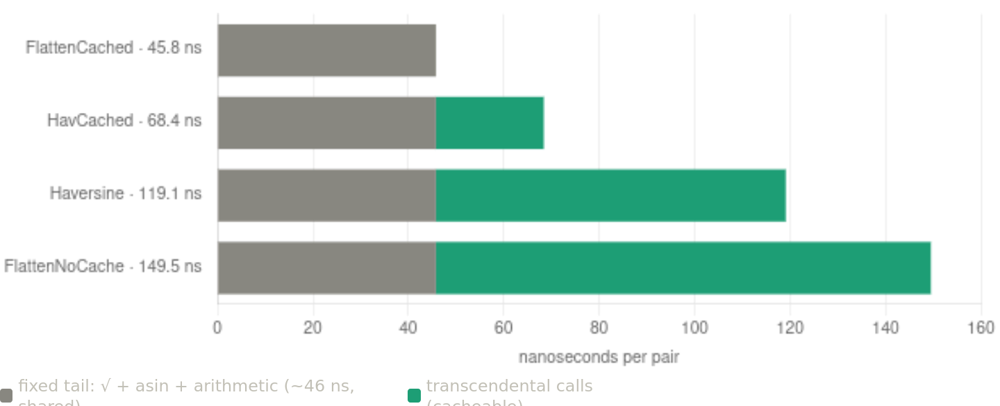

# Benchmark results

Recorded 2026-06-21_1335 · companion to `geodist.go` / `geodist_test.go` (suite v2026-06-21_1305).

## Environment

| | |
|---|---|
| goos / goarch | linux / amd64 |
| CPU | Intel Core i5-4460 @ 3.20 GHz |
| GOMAXPROCS | 4 (the `-4` suffix on each benchmark name) |
| package | `geodist` |
| Go version | *not captured — run `go version` and record it here* |
| command | `go test -bench=. -benchmem -run=^$` (single pass, default `-count=1`) |

Numbers are from one run on one machine; treat them as relative, not portable. For
publication-grade figures, re-run with `-count=6 -benchtime=2s` and pass through
`benchstat` (see README).

## Raw output

```
BenchmarkPair_Distance-4                 6047930   187.8 ns/op    0 B/op   0 allocs/op
BenchmarkPair_DistanceFast-4             9623641   124.3 ns/op    0 B/op   0 allocs/op
BenchmarkPair_FlattenDistance-4          8079607   148.6 ns/op    0 B/op   0 allocs/op
BenchmarkAllPairs/Haversine/N=64-4          4047   261729 ns/op       0 B/op   0 allocs/op
BenchmarkAllPairs/FlattenNoCache/N=64-4     4054   334774 ns/op       0 B/op   0 allocs/op
BenchmarkAllPairs/FlattenCached/N=64-4     12931    88547 ns/op    1536 B/op   1 allocs/op
BenchmarkAllPairs/HavCached/N=64-4          8468   133583 ns/op    1536 B/op   1 allocs/op
BenchmarkAllPairs/Haversine/N=256-4          298  3947491 ns/op       0 B/op   0 allocs/op
BenchmarkAllPairs/FlattenNoCache/N=256-4     254  5213313 ns/op       0 B/op   0 allocs/op
BenchmarkAllPairs/FlattenCached/N=256-4      858  1377622 ns/op    6144 B/op   1 allocs/op
BenchmarkAllPairs/HavCached/N=256-4          558  2126104 ns/op    6144 B/op   1 allocs/op
BenchmarkAllPairs/Haversine/N=1024-4          19 62385403 ns/op       0 B/op   0 allocs/op
BenchmarkAllPairs/FlattenNoCache/N=1024-4     15 78321727 ns/op       0 B/op   0 allocs/op
BenchmarkAllPairs/FlattenCached/N=1024-4      44 23978194 ns/op   24576 B/op   1 allocs/op
BenchmarkAllPairs/HavCached/N=1024-4          32 35830523 ns/op   24576 B/op   1 allocs/op
```

## Single pair (ns/op)

| function | ns/op | vs DistanceFast |
|---|---:|---:|
| `DistanceFast` | 124.3 | 1.00× |
| `FlattenDistance` | 148.6 | 1.20× slower |
| `Distance` (with `Pow`) | 187.8 | 1.51× slower |

Removing the two `math.Pow` calls (`Distance` → `DistanceFast`) is a 1.51× speedup,
about 32 ns per `Pow` for what is just a squaring. For a single distance the haversine
beats the flatten form, as the op count predicted: the flatten form's `tan` calls cost
it ~25 ns more than the haversine's `sin`/`cos`.

## All-pairs, normalised per pair

Divide each total by the pair count `N(N-1)/2` (2 016 / 32 640 / 523 776). The per-pair
cost is flat across N — the O(n) precompute is negligible against O(n²) pairs.

| method | forward trig/pair | N=64 | N=256 | N=1024 |
|---|---:|---:|---:|---:|
| `FlattenCached` | 0 | 43.9 | 42.2 | 45.8 |
| `HavCached` | 1 (`cos Δλ`) | 66.3 | 65.1 | 68.4 |
| `Haversine` (recompute) | 4 | 129.8 | 120.9 | 119.1 |
| `FlattenNoCache` | 4 (2 `tan` + 2 `sincos`) | 166.1 | 159.7 | 149.5 |

## Cost decomposition (per pair, N=1024)

Taking `FlattenCached` (zero forward trig) as the measured floor:

- fixed tail (divides + `sqrt` + `asin`), shared by all: **~46 ns**
- one forward trig op on this CPU: **~20 ns**
  - cross-check 1: `DistanceFast` 124.3 − 46 = 78.3 over 4 trig ≈ 19.6 ns each
  - cross-check 2: `Haversine`/pair 119.1 − 46 = 73.1 over 4 trig ≈ 18.3 ns each
- one cosine (the only per-pair difference between the two caches):
  `HavCached` − `FlattenCached` = 68.4 − 45.8 = **22.6 ns** — the "exactly one cosine"
  prediction, measured.
- `tan` is heavier than `sin`/`cos`: `FlattenNoCache` 149.5 − 46 = 103.5 for 2 `tan`
  + 2 `sincos` ⇒ `tan` ≈ 27 ns each.

## Speedups (N=1024, by total time)

| comparison | factor |
|---|---:|
| `FlattenCached` vs `FlattenNoCache` | 3.27× |
| `FlattenCached` vs `Haversine` | 2.60× |
| `FlattenCached` vs `HavCached` | 1.49× |

## Allocations

Cached forms make exactly one slice allocation per batch, 24 bytes × N
(`FlatPoint` and `GeoPoint` are both 3×float64): 1 536 / 6 144 / 24 576 B at
N = 64 / 256 / 1024. Zero allocations in the pair loop. The recompute forms
allocate nothing.

## Conclusions

1. Fix the `Pow`. `Distance` → `DistanceFast` is a free 1.5× with no behaviour change.
2. One or two distances → `DistanceFast`. The flatten form can't amortise its
   per-point work over so few pairs.
3. Any all-pairs / repeated-from-a-fixed-set workload → `FlattenCached`. It is the
   fastest once it can amortise (caching wins from N=64 upward — no crossover penalty
   was observed), and it keeps haversine's small-angle conditioning because it still
   routes through `asin(sqrt(a))` rather than a precision-losing `acos`.
4. `FlattenCached` beats `HavCached` by precisely one cosine per pair (~22.6 ns); both
   beat naive recomputation by paying their trig once per point instead of once per pair.

The precomputed `FlatPoint{re, im, |w|²}` is the cheapest carrier of great-circle
distance once reused — the computational echo of the disk-representation result that
the stereographic image carries the sphere's metric, not just its picture.

